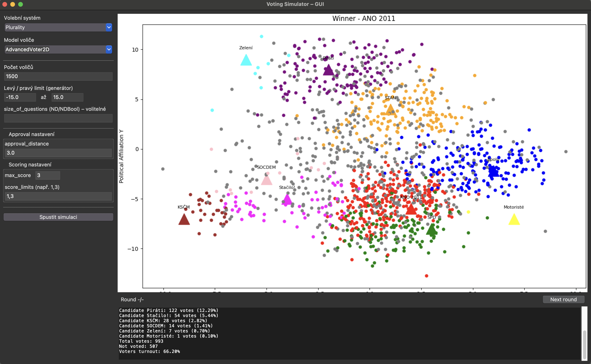
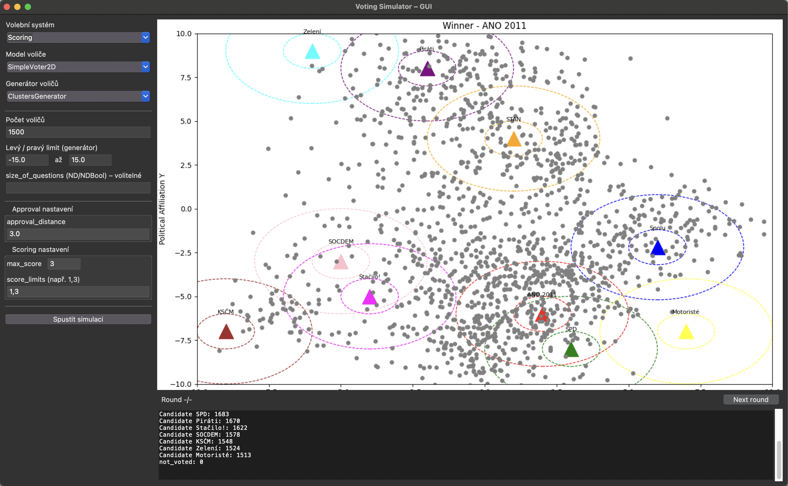

# Simulation of Electoral Systems

A Python-based simulator designed to mathematically and algorithmically analyze the impact of different electoral systems on election outcomes. This project was developed as part of a bachelor's thesis to demonstrate how different voting methods can translate the exact same set of voter preferences into entirely different collective decisions.

The simulation currently models the context of the **Czech Parliamentary Elections (2025)**, mapping political parties and voter clusters onto a 2D political spectrum, while incorporating real-world variables like candidate popularity and voter turnout willingness.

## 🌟 Key Features

* **Multiple Electoral Algorithms:** Compares 5 distinct voting systems side-by-side.
* **Advanced Voter Models:** Simulates voter behavior using 1D, 2D, or N-Dimensional opinion arrays. Voters make decisions based on political distance, candidate popularity, and a dynamically calculated "willingness to vote."
* **Realistic Population Modeling:** Generates voter populations uniformly or in defined socio-economic clusters (e.g., *Working-class conservatives*, *Progressive liberals*, *Technocrats*).
* **Dual Interface:** Includes a Graphical User Interface (GUI) for ease of use and a Command Line Interface (CLI) for advanced/automated simulation runs.

## 🗳️ Implemented Electoral Systems

1. **Plurality (Relative Majority):** Standard "first-past-the-post" voting.
2. **Instant Runoff Voting (IRV / Alternative Vote):** Ranked-choice voting where the lowest-performing candidates are iteratively eliminated.
3. **Approval Voting:** Voters can vote for as many candidates as they approve of.
4. **Condorcet Method:** Identifies the candidate who would win a head-to-head matchup against every other candidate.
5. **Score Voting:** Voters rate candidates on a defined scale (e.g., 0 to 5), and the highest total score wins.

## 🚀 Installation & Setup

Prerequisites: Python 3.12

1. Clone the repository:
```bash
git clone [https://github.com/yourusername/electoral-system-simulator.git](https://github.com/yourusername/electoral-system-simulator.git)
cd electoral-system-simulator
```

2. Create and activate a virtual environment:
```bash
python3 -m venv venv
source venv/bin/activate  # On Windows use: venv\Scripts\activate
```

3. Install required dependencies:
```bash
pip install -r req.txt
```

## 💻 Usage

### Graphical Interface (GUI)

Simply run the main script without any arguments to open the visual configurator:
```Bash
python3 main.py
```

### Command Line Interface (CLI)

You can bypass the GUI and run specific simulations directly from the terminal.Basic Syntax:
```Bash
python3 main.py <electoral-system-type> [additional-parameters]
```

### Available Commands:

- plurality (Default)
- instant_runoff (Aliases: irv, runoff)
- approval (Alias: approve)
    - Requires parameter: approval_distance (e.g., 3)
- condorcet
- scoring (Alias: score)
    - Requires parameters: Number of scoring circles and circle sizes.


## 🧠 Architecture Overview

### Voter Models

Located across `simpleVoter.py`, `voter2D.py`, and `voterND.py`, the simulator utilizes three tiers of complexity:

- **SimpleVoter:** Votes strictly based on Euclidean/array distance to candidates.
- **SimpleAdvancedVoter:** Introduces a `willingness_to_vote` probability. The further the closest candidate is, the less likely the voter is to cast a ballot.
- **AdvancedVoter:** Incorporates candidate popularity as a gravity-like metric. Highly popular candidates can pull votes from further away and overcome minor distance discrepancies, mimicking real-world political charisma.

### Population Generation

- **uniformGenerator.py:** Scatters voters evenly across the political space.
- **clustersGenerator.py:** Groups voters into predefined societal clusters with distinct centers, variances (σ), and baseline turnout estimations.

## 📊 Results & Visualization

The simulator includes plotting features to visualize the spatial distribution of voters and the area of influence for each candidate.

Full documentation of the results can be found [here](./documentation-en-results.pdf).




## 📄 License

This project was created as seminar work for course KIV/VSS (Performance and reliability of programming systems) by Jiří Winter. It is licensed under the MIT License. All original code and implementations are included, with the exception of external libraries and dependencies listed in `req.txt`.

For the full license text, see the LICENSE file in the repository. 

